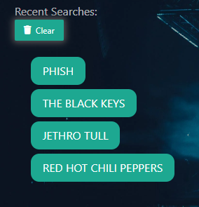
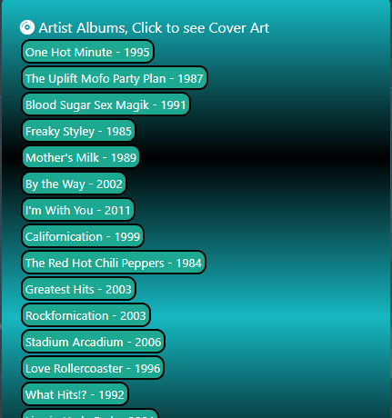
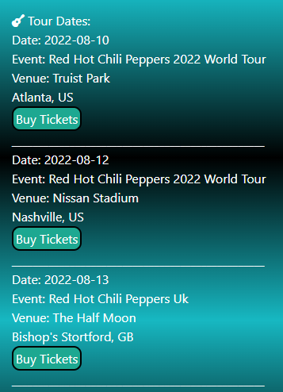
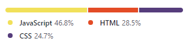

<h1 align="center"> 
Bandopedia Music App &#153
</h1>

&nbsp;

<h3 align="center">
Welcome to Bandopedia, an app where you can search you favorite artist or bands to find out, band information, touring schedules, album discographies and more to come!!!
</h3>

&nbsp;

### Table of Content

- [User Story](#user-story)
- [Description](#Description)
- [Technology](#Technology)
- [Links](#Links)
- [Credits](#credits)
- [Acknowledgments](#Acknowledgments)
- [License](#license)

# User Story

    - AS A Music Enthusiast
    - I WANT an app to search bands or artists for tour info, band info and social media links.
    - SO THAT I plan my out my year to see concerts.

&nbsp;

# Description

&nbsp;

Welcome to Bandopedia!   When the user opens the page they are greeted with a simple search page. Just enter the band of your choice. (Shown Below)

&nbsp;

From there, user will be taken to the main page with their searched artist displayed at the top. Under the artist name are four social media links that will take user directly to all of that artists social media pages.

&nbsp;

Below that user will see an "Artist Bio" button which on click will drop a collapsible section that will display the history of the artist. After opening, this section can be re-hidden by clicking anywhere on the text. 

&nbsp;

The lower section is broken into three seperate columns. The first is a search history. Each artist that is searched will be displayed in this column and have a button that will quickly take you back to all of that artists information. This also saves artists into local storage on users machine so that all past searches are shown when the user revisits the page. All search results can be deleted by using the clear button. 

&nbsp;

The second column is a discography of the artist that lists all of their released albums and year in which they were released. User can click each album name and a modal will open to show the cover art of that album. 

  
  

&nbsp;

The final column is a list of all the upcoming concert listings for that artist. User will be shown the date, event name, venue and city for each event. Below this information is a link to that specific events ticketmster page where tickets can be purchased. 

  
  

&nbsp;

# Technology

   

&nbsp;

&nbsp;

The site uses two API sources to compile data, they are:
 
https://app.ticketmaster.com
 
https://theaudiodb.com

&nbsp;

# Links 

&nbsp;

https://joseeenrique.github.io/Music-App/

 [Wireframe](https://www.figma.com/file/AKJv6EhSlxbtuM9MjxTo0M/Untitled?node-id=0%3A1) 

&nbsp;

# Credits

| Sammy Pennell                                                                                                                        |                                                             Bryan Wienhoff                                                              |                                                               Jose Martinez                                                               |                                                                                                                             Dylan Macres |
| :----------------------------------------------------------------------------------------------------------------------------------- | :-------------------------------------------------------------------------------------------------------------------------------------: | :---------------------------------------------------------------------------------------------------------------------------------------: | ---------------------------------------------------------------------------------------------------------------------------------------: |
|  |  |  |  |

<!--  -->

&nbsp;

# Acknowledgments
Kirtley Adams (Teaching Assistant)  
Dan Kaltenbaugh (Instructor) 
George Yoo (Teaching Assisstant)

# License

